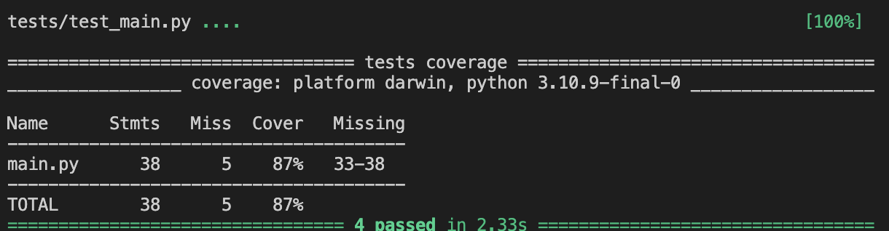

# Personal Immersion Tracker 

This project is a personal immersion tracking tool built with FastAPI, Supabase, and Streamlit. It fulfills the  requirements of the Keploy API Fellowship Assignment #2 by implementing a custom API with 4+ endpoints, full CRUD functionality, and integration with a real database. Users can log time spent on various language immersion activities, update or delete their logs, and view statistics like total time by activity type. A simple Streamlit-based frontend is also provided for interacting with the API.

## Features

- Log immersion activities (type, duration, description, date)
- Retrieve all logs
- Filter total time by type
- Update existing logs
- Delete logs
- Streamlit-based frontend for easy interaction

---

## Tech Stack

- **Backend:** FastAPI
- **Database:** Supabase (PostgreSQL)
- **Frontend:** Streamlit
- **API Testing:** Swagger UI (`/docs`)

---

## API Endpoints

| Method | Endpoint          | Description                        |
|--------|-------------------|------------------------------------|
| POST   | `/log`            | Add a new immersion log            |
| GET    | `/logs`           | Get all immersion logs             |
| GET    | `/time?type=xyz`  | Get total duration (optional type) |
| PUT    | `/log/{log_id}`   | Update a specific log              |
| DELETE | `/log/{log_id}`   | Delete a specific log              |

---
## API Documentation

## Example Log Format

```json
{
  "type": "listening",
  "duration": 30,
  "description": "Watched anime",
  "date": "2025-06-19"
}
```

### Add a New Immersion Log

**POST** `/log`

**Request Body:**

```json
{
  "type": "listening",
  "duration": 30,
  "description": "Watched anime",
  "date": "2025-06-19"
}
```
**Response:**

```json
{
  "status_code": 200,
  "data": [...]
}
```

### Retrieve All Logs

**GET** `/logs`

**Response:**

```json
[
  {
    "id": "uuid-string",
    "type": "reading",
    "duration": 25,
    "description": "Read a Japanese blog",
    "date": "2025-06-19"
  }
]
```
### Get Total Time

**GET** `/time?selected_type=reading`  
*(Query param `selected_type` is optional)*

**Response:**

```json
{
  "total_duration": 95
}
```
### Update a Log

**PUT** `/log/{log_id}`

**Request Body:**

```json
{
  "type": "reading",
  "duration": 45,
  "description": "Updated log",
  "date": "2025-06-20"
}
```
**Response:**

```json
{
  "status_code": 200,
  "data": [...]
}
```
### Delete a Log

**DELETE** `/log/{log_id}`

**Response:**

```json
{
  "status_code": 200,
  "message": "Log deleted successfully"
}
```

## Setup Instructions

### 1. Clone the repository

```bash
git clone https://github.com/yourusername/immersion-tracker.git
cd immersion-tracker
```
### 2. Create and activate a virtual environment

```bash
python -m venv venv
source venv/bin/activate
```

### 3. Install dependencies

```bash
pip install -r requirements.txt
```

### 4. Add a `.env` file

Create a `.env` file in the root directory and include:

```ini
SUPABASE_URL=your_supabase_url
SUPABASE_KEY=your_supabase_anon_key
```

### 5. Run the FastAPI backend

```bash
uvicorn main:app --reload
```
Then visit the API docs at: [http://127.0.0.1:8000/docs](http://127.0.0.1:8000/docs)

### 6. Run the Streamlit frontend

In a new terminal (with your virtual environment still activated):

```bash
streamlit run streamlit_app.py
```
Then open your browser and go to: [http://localhost:8501](http://localhost:8501)


## Testing

This project includes unit tests, integration tests, and API tests for the FastAPI server.

### Test Types

- Unit Tests: Logic tested with mocked Supabase responses.
- Integration/API Tests: Full end-to-end flow (Create → Read → Update → Delete) using real Supabase.

### Frameworks/Tools Used

- pytest – for writing and running tests
- pytest-cov – to generate coverage reports
- pytest-mock – for mocking Supabase

### How to Run Tests

Make sure you're in your virtual environment.

```bash
pip install -r requirements.txt
PYTHONPATH=. pytest --cov=main --cov-report=term-missing tests/
```
### Coverage
Achieved 87% test coverage on main.py.



